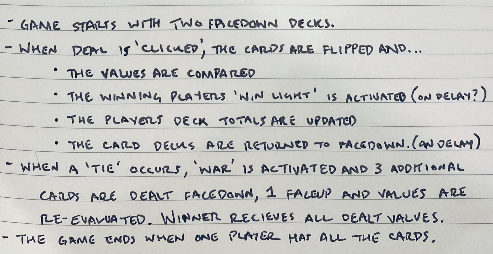

# **"War"**

### Date: 2/14/2020

#### By: Michael Lackey
***

### ***Description***

>  ##### A rendition of "War", the card game, where the highest card wins.
***

### ***Technologies Used***

>  ##### JavaScript, HTML, CSS, jQuery
***

### ***Getting Started***

>  ##### The project can be viewed [here](https://mlackey9601.github.io/War/).
***

### ***Screenshots***

> ###### Rough Wireframe
> 
> ###### Pseudocode
> 
***

### ***User Experience***

>  #### User Story #1
>  ##### A brief description of someone and why they would engage with this project.
>  #### User Story #2
>  ##### A brief description of someone and why they would engage with this project.
>  #### Minimum Viable Product
>  ##### * As a user, ...
>  ##### * As a user, ...
>  ##### * As a user, ...
***

### ***Next Steps***

>  ##### * Planned future enhancements (icebox items)
>  ##### * This is the section for your "want list"
>  ##### * ~~Strikethrough items once you've updated the project~~
***

### ***Credits***

> ##### Credit: [Description](url)
>
> ##### Credit: [Description](url)
>  
> ##### Credit: [Description](url)
***
