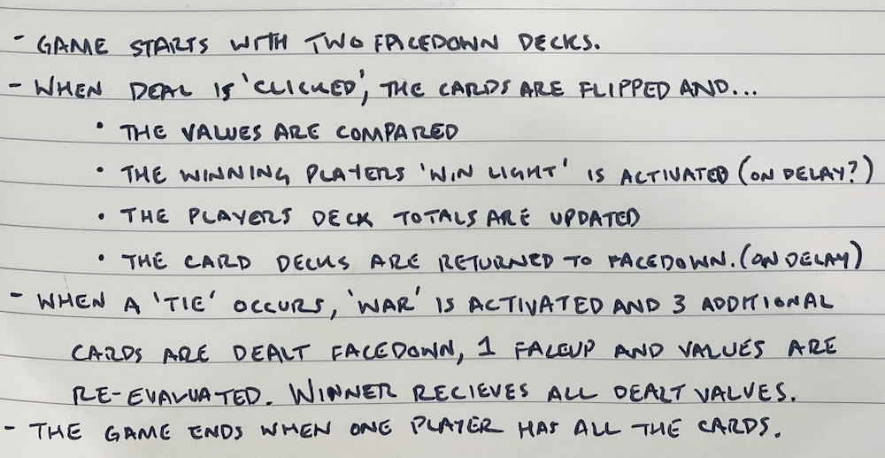
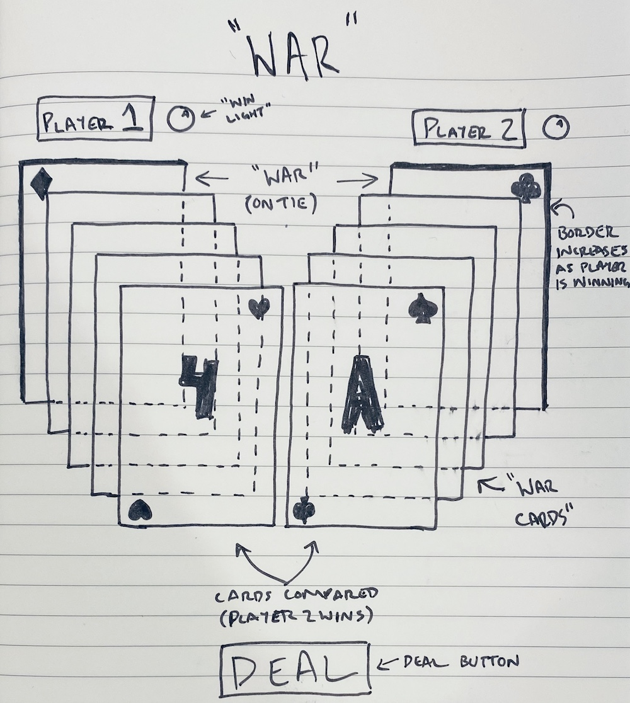
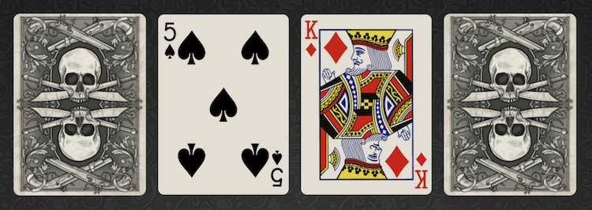
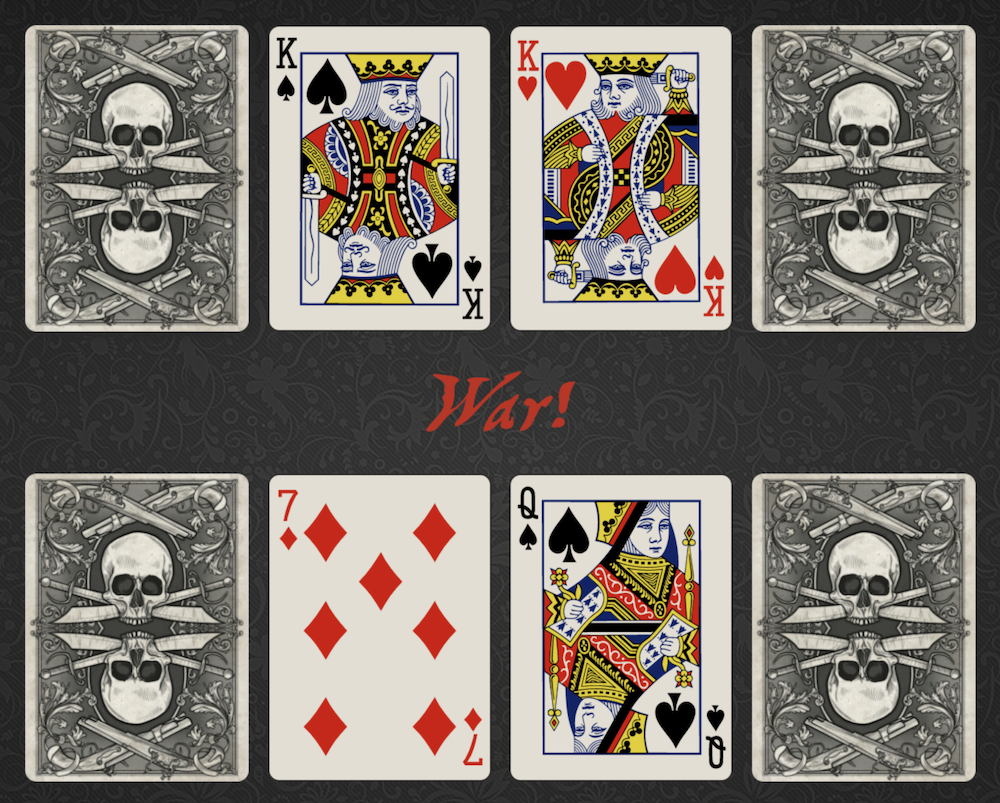
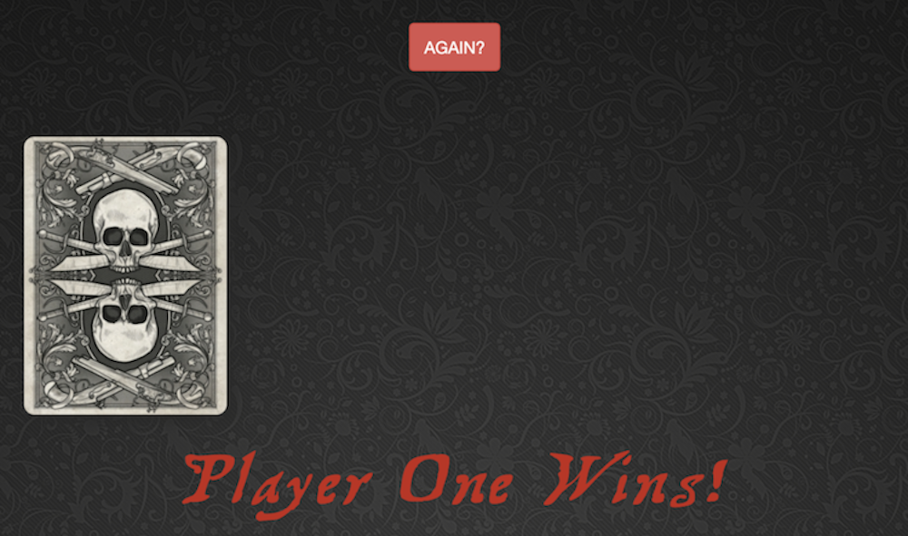

# **"War"**

### Date: 2/14/2020

#### By: Michael Lackey
***

### ***Description***

##### A rendition of "War", the card game, where the highest card wins.
***

### ***Technologies Used***

* ##### JavaScript
* ##### HTML
* ##### CSS
***

### ***Getting Started***

##### Each player starts with half of the deck (26 cards). Begin each hand by hitting the 'Deal' button.  The player with the highest card wins the hand and is awarded the other players card.  In the event of a tie, 3 additional cards are burned and a 4th is flipped.  These cards are then evaluated and the player with the highest card wins *all* of the played cards.  The game ends when one player has all 52 cards in the deck.
##### The project can be viewed [here](https://mlackey9601.github.io/War/).
***

### ***Screenshots***

###### Pseudocode

###### Rough Wireframe

###### Final Product

###### War!

###### End of Game

***

### ***User Experience***

#### User Story #1
##### Tom read online that 'War' is one of the best games to play at a Casino because of it's better odds against the dealer.  He wants to practice online before his big trip to Las Vegas.
#### User Story #2
##### Lucy wants to play a card game with her friend.  She want's one that is easy to learn and easy to play.
#### Minimum Viable Product
* ##### As a user, I should be able to click the 'Flip' button and the hand take place.
* ##### As a user, I should see the cards flipped, then it be obvious who won the hand.
* ##### As a user, I should be able to tell who is winning the game (shading).
* ##### As a user, I should know when I have won/lost the game.
***

### ***Future Updates***

- [x] ~~Create a 'Play Again' button~~
- [ ] Create a win counter for each player
- [ ] Allow the user to choose their deck image
- [ ] Toggle music, flip sounds, and background
- [x] ~~Create a 'card flip' animation~~
- [x] ~~Add 'card flip' sound effects~~
- [ ] Scale for mobile
***

### ***Credits***
  
##### Black Felt Background - [hipwallpaper.com](https://hipwallpaper.com/)

<!-- ##### Elf Card Back - [Dustin Panzino, Inkwell Illustrations](https://inkwellillustrations.com) -->

##### Pirate Card Back - [vippng.com](http://vippng.com)

##### Pirate Font - [free-fonts.com](https://www.free-fonts.com/)

##### Animations - [Animate.css](https://daneden.github.io/animate.css/)

##### Button Styling - [Bootstrap](https://getbootstrap.com/)
***