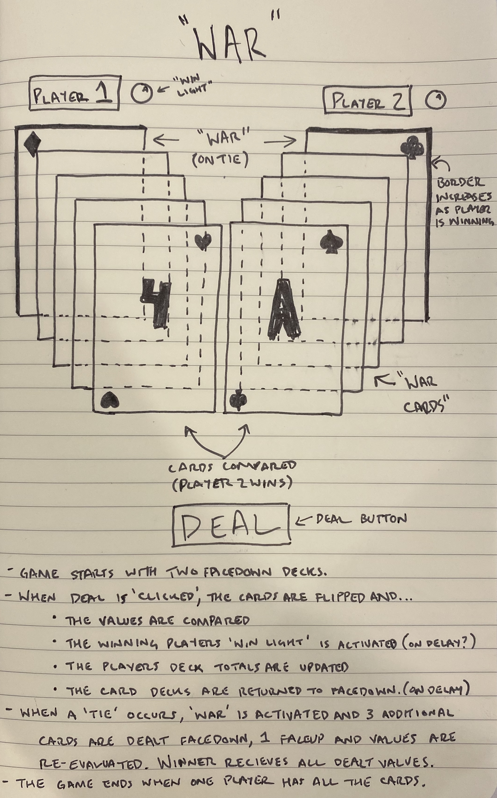

# **"War"**

### Date: 2/6/2020

#### By: Michael Lackey
***

### ***Description***

>  ##### A rendition of "War" the card game, where the highest card wins.
***

### ***Screenshots***
> 
> ###### Rough Wireframe
> 
> ###### Pseudocode
***

### ***Technologies Used***

>  ##### JavaScript, HTML, CSS
***

### ***Getting Started***

>  ##### In this section include the link to your project and any instructions you deem important.
***

### ***User Experience***

>  #### User Story #1
>  ##### A brief description of someone and why they would engage with this project.
>  #### User Story #2
>  ##### A brief description of someone and why they would engage with this project.
>  #### Minimum Viable Product
>  ##### * As a user, ...
>  ##### * As a user, ...
>  ##### * As a user, ...
***

### ***Next Steps***

>  ##### * Planned future enhancements (icebox items)
>  ##### * This is the section for your "want list"
>  ##### * ~~Strikethrough items once you've updated the project~~
***

### ***Credits***

> ##### Credit: url
>
> ##### Credit: url
>  
> ##### Credit: url
***
