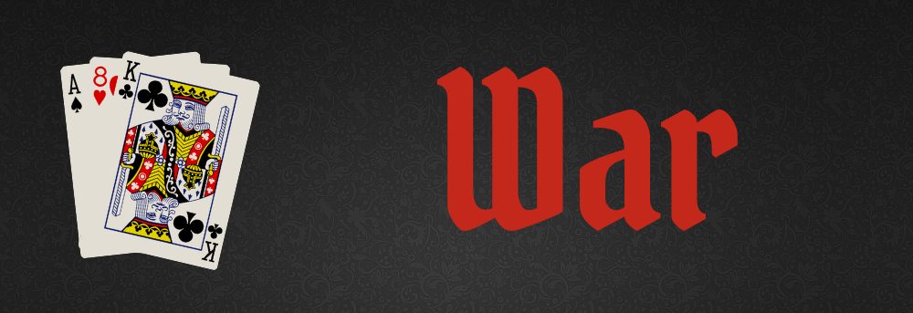

### Date: 2/14/2020

#### By: Michael Lackey
#### [Website](https://michaellackey.com/) | [GitHub](https://github.com/mlackey9601) | [LinkedIn](https://www.linkedin.com/in/michaelglackey/) | [GA Profile](https://profiles.generalassemb.ly/michaellackey)
***

### ***Description***

##### A rendition of "War", the card game, where the highest card wins.
***

### ***Technologies Used***

* ##### Chajr 1.1.0
* ##### HTML
* ##### CSS
* ##### JavaScript
***

### ***Getting Started***

##### Each player starts with half of the deck (26 cards). Begin each hand by hitting the 'Flip' button.  The player with the highest card wins the hand and is awarded the other players card.  In the event of a tie, 3 additional cards are burned and a 4th is flipped.  These cards are then evaluated and the player with the highest card wins *all* of the played cards.  The game ends when one player has all 52 cards in the deck.
##### The project was deployed on GitHub Pages and can be viewed [here](https://mlackey9601.github.io/War/).
***

### ***Screenshots***

###### War!

###### End of Game

***

### ***Future Updates***

- [x] ~~Create a 'Play Again' button~~
- [x] ~~Create a 'card flip' animation~~
- [x] ~~Add 'card flip' sound effects~~
- [ ] Create a win counter for each player
- [ ] Allow the user to choose their deck image
- [ ] Toggle music, flip sounds, and background
- [ ] Scale for mobile
***

### ***Credits***
  
##### App Scaffolding: [Chajr](https://github.com/davidstinson/chajr)

##### Black Felt Background: [hipwallpaper.com](https://hipwallpaper.com/)

##### Pirate Card Back: [vippng.com](http://vippng.com)

##### Pirate Font: [free-fonts.com](https://www.free-fonts.com/)

##### Animations: [Animate.css](https://daneden.github.io/animate.css/)

##### Button Styling: [Bootstrap](https://getbootstrap.com/)
***